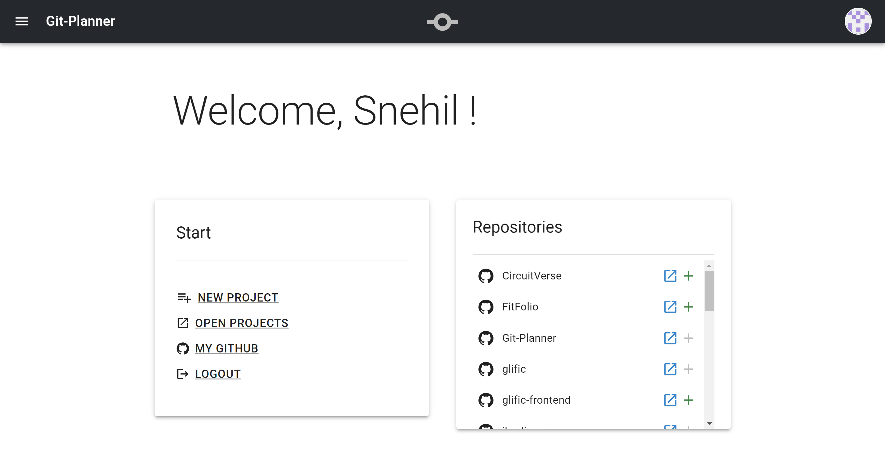
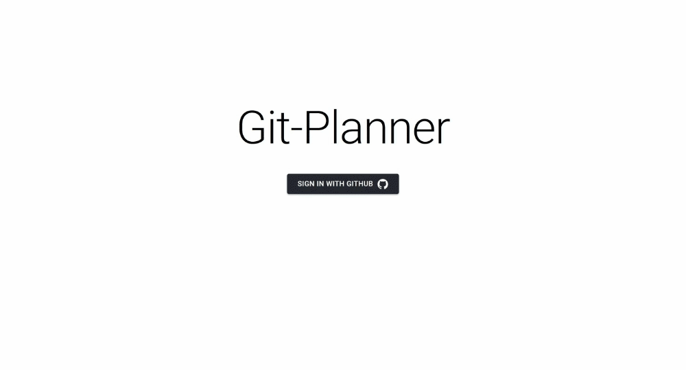
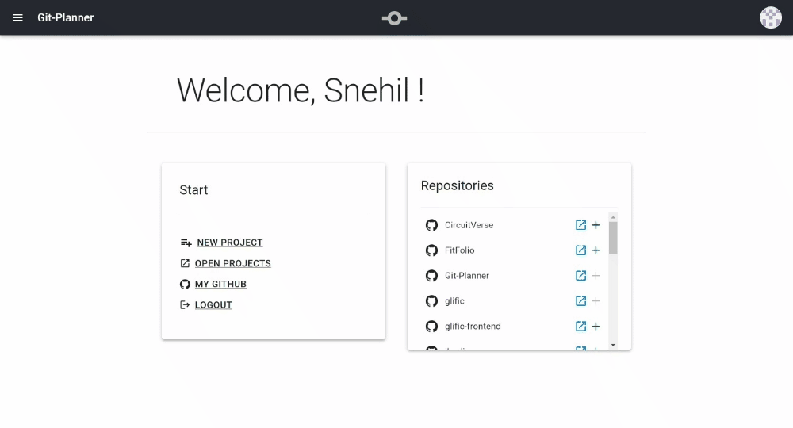
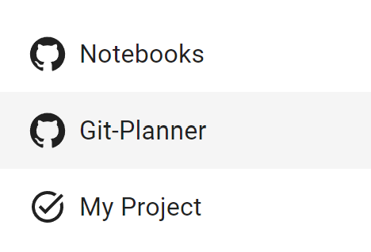
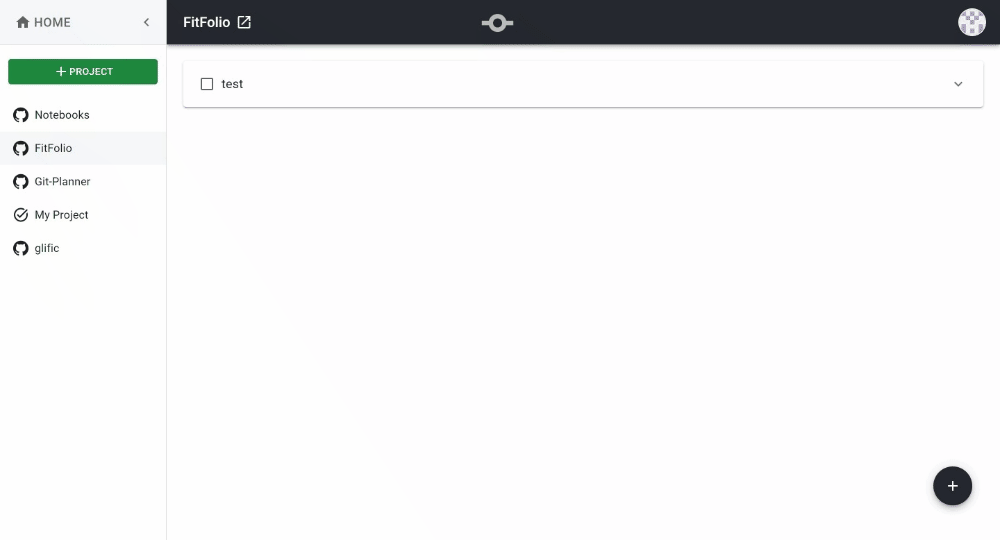
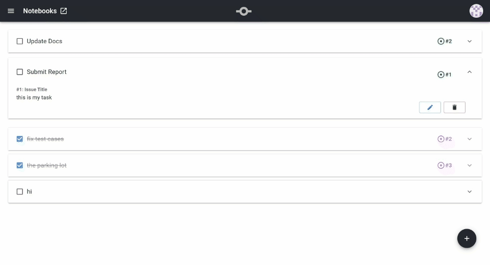
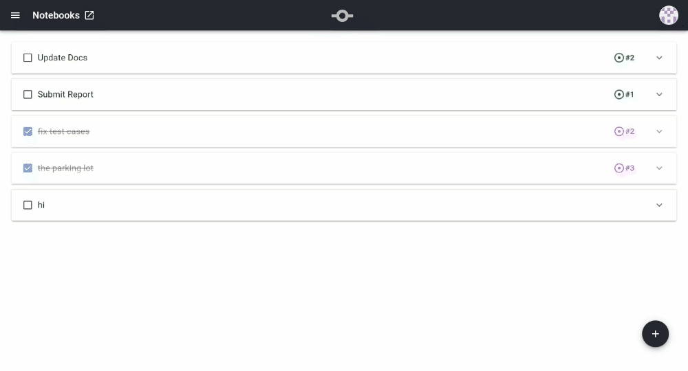
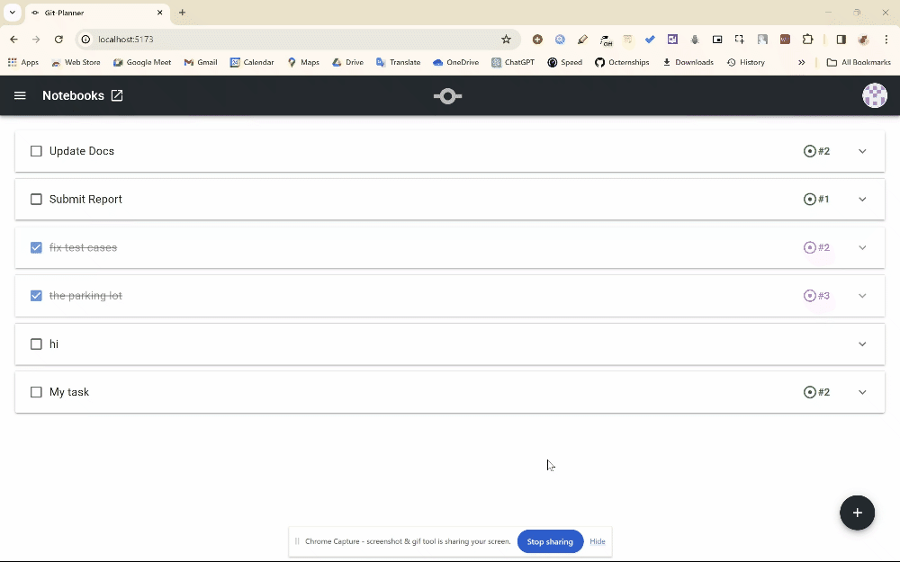
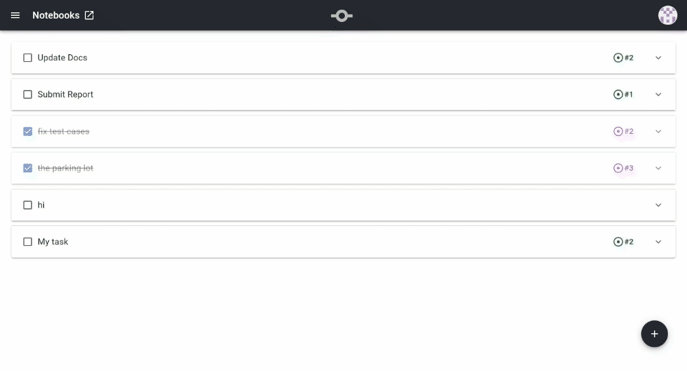

  <h1 align="center">Git-Planner</h1>

  

    Plan out your Github or Personal Projects with this Full-Stack Project Planner Web App powered by the Github API.
  

<h3>• Technologies Used</h3>

- React.js & Material UI - Frontend
- Node.js & Express.js - Backend
- MongoDB - Database
- Github API
- Passport - Oauth 2.0 Authentication

<h3>• In Action</h3>

- **Login & Logout using OAuth**: Login using your Github Account!

- **Projects**
  

Create Projects from your existing Repositories or start a new one
  

    
Or quickly select one of your Github Repositories from the Home Tab

Delete Projects once you are done!

- **Tasks**

Create & Link Tasks to Issues in your Github Repository!

Delete & Edit Tasks as you want!

